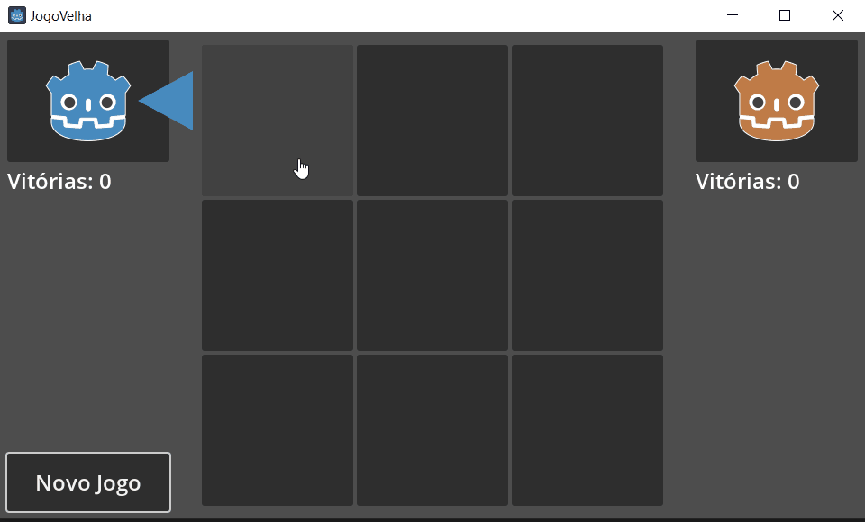
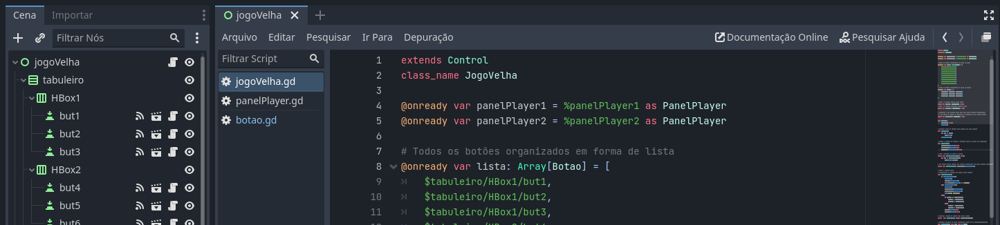
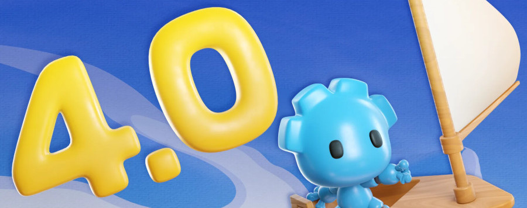

# JogoVelha-Godot-4.1.1
 Um simples jogo da velha para explorar o potencial dos componentes de UI da Godot 4

## Game Download

Confira as versões compiladas em [Releases](https://github.com/diogorbg/JogoVelha-Godot-4.1.1/releases).

* [jogoVelha_win_v0.2.zip](https://github.com/diogorbg/JogoVelha-Godot-4.1.1/releases/download/v0.2/jogoVelha_win.zip)

---

## Sobre as variações de projeto
Neste repositório você pode encontrar 3 versões diferentes do projeto JogoVelha-Godot-4.1.1, são elas:

### Branch main
Uma versão mais direta do jogo da velha. Implementa a interface do jogo e a possibilidade de jogar contra a IA.
* Projeto Godot: [jogoVelha_main.zip](https://github.com/diogorbg/JogoVelha-Godot-4.1.1/archive/refs/heads/main.zip)

### Branch colorSelect
Uma variação que permite a customização da cor do jogador. Implementa a utilização da classe Resource para a criação de 6 possibilidades de cores.
* Projeto Godot: [jogoVelha_colorSelect.zip](https://github.com/diogorbg/JogoVelha-Godot-4.1.1/archive/refs/heads/colorSelect.zip)

### Branch webSocket (em desenvolvimento...)
Uma versão mais avançada que permite jogar em rede. Implementa um cliente WebSocket que se conecta com um servidor que gerencia usuários e estados do jogo.
* Projeto Godot: [jogoVelha_webSocket.zip](https://github.com/diogorbg/JogoVelha-Godot-4.1.1/archive/refs/heads/webSocket.zip)

---

## Inteligência Artificial

Agora você pode jogar contra uma IA. Ela é feita para ser balanceada. Ela não deixa de ganhar/defender se estiver por uma única jogada, mas ela também não é capaz de criar estratégias para vencer. Em vez disso a IA joga aleatoriamente. Ela segue as seguintes prioridades:
1. Verifica se existe uma jogada vitoriosa, onde se vence o jogo.
2. Verifica se existe uma jogada de defesa, onde se impede o oponente.
3. Não restando opção a IA é forçada jogar aleatoriamente.

---

## Sobre a Godot

A Gogot é uma engine com um potencial gigantesco para o desenvolvimento de jogos. Ela é gratuita, flexível e oferece recursos profissionais. Com o aumento da popularidade da engine, é provável que ela se torne uma das principais opções para desenvolvedores de jogos indie e AAA no futuro.

* A Godot é baseada em código aberto, o que significa que é gratuita e pode ser personalizada por qualquer desenvolvedor. Além disso, ela é muito flexível, o que permite que seja usada para criar jogos de todos os gêneros e plataformas.
* A Gogot é uma opção viável para desenvolvedores que buscam uma engine gratuita e flexível, mas que ainda oferece recursos profissionais.
* A engine tem potencial para se tornar uma das principais opções para desenvolvedores de jogos indie e AAA.
* [Eu estava errado sobre o GODOT... - Uniday Studio](https://www.youtube.com/watch?v=vNDUVor9RUw)
* [Godot’s Node System, Part 3: Engine Comparisons](https://willnationsdev.wordpress.com/2018/04/07/godots-node-system-part-3-engine-comparisons)

Acontecimentos recentes envolvendo a Unity e a comunidade indie colocaram a Gogot em evidência, pois os desenvolvedores indie buscavam por uma engine substituta. A dura realidade para os desenvolvedores é que essa substituta não existe, pois não há como migrar projetos entre engines, mas a dura realidade para a Unity é que os desenvolvedores passaram a considerar novas características desejáveis em uma engine.

* [A Godot está FAZENDO NÚMEROS!](https://www.youtube.com/watch?v=XsWhF08_vnQ)

## Tutoriais em Godot 4

A Godot 4 trouxe um série de melhorias que mudam significativamente o fluxo de produção. Pelo menos na minha visão, a mais aguardada era a possibilidade de criar variáveis e funções estáticas. Isso é uma necessidade quando se trabalha com Unity, C# e demais linguagens de programação. A forma com que era feita na Godot 3 era confusa e agora foi resolvida.
Logo, nem preciso dizer o quão importante é a busca por materiais sobre Godot 4. Vou listar alguns bons materiais que encontrei em minhas buscas recentes:

* [Tutorial GODOT 4.0 - Plataforma 2D - Clécio Espindola GameDev](https://www.youtube.com/watch?v=egniMIdMoMU&list=PL-oJEh-N3A3SOPWuMuulbnJv0BFgvBnVG)
* [RPG TopDown - (Godot 4.0) - DevBandeira](https://www.youtube.com/watch?v=BmJlBFUVBDo&list=PLFzAtSiFUbT-UZcEli_IlKFQdk3FEBMlq)
