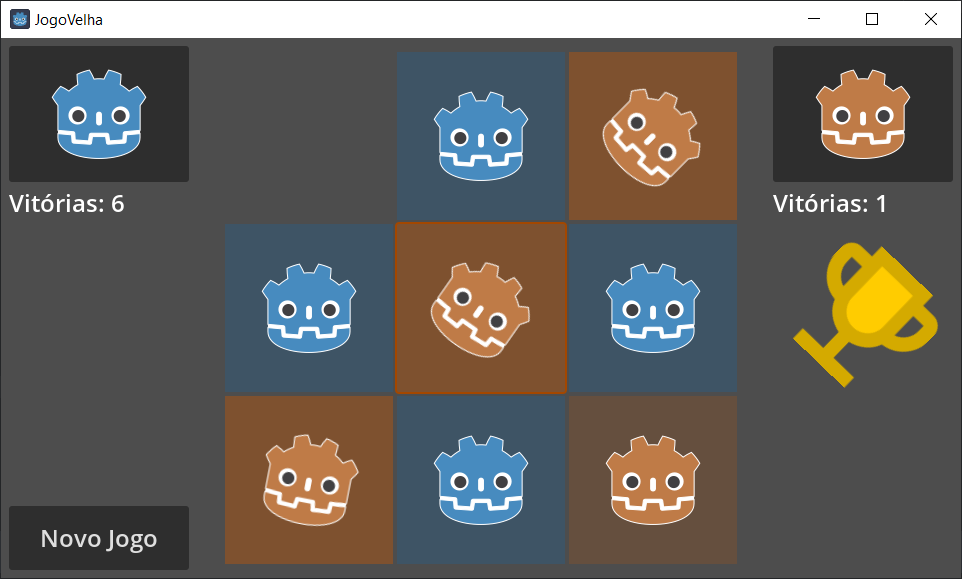

# JogoVelha-Godot-4.1.1
 Um simples jogo da velha para explorar o potencial dos componentes de UI da Godot 4

## Game Download

Confira as versões compiladas em [Releases](https://github.com/diogorbg/JogoVelha-Godot-4.1.1/releases).

* [jogoVelha_win_v0.1.zip](https://github.com/diogorbg/JogoVelha-Godot-4.1.1/releases/download/v0.1/jogoVelha_win.zip)
